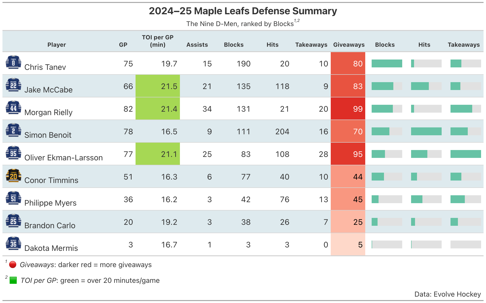

```{r setup, include=FALSE}
# ---------------------------------------------------------------
# Global setup – load libraries & fonts once per knit
# ---------------------------------------------------------------
knitr::opts_chunk$set(
  echo    = TRUE,
  message = FALSE,
  warning = FALSE
)

# Core visual / data wrangling libraries
library(readr)
library(dplyr)
library(scales)
library(ggplot2)
library(ggradar)
library(patchwork)
library(RColorBrewer)
library(purrr)
library(viridis)
library(sportyR)
library(gt)
library(gtExtras)
library(glue)
library(png)
library(rsvg)
library(grDevices)
library(tidyr)
library(extrafont)
library(webshot2)
library(ggtext)

## Every knit: make sure PDF device knows the fonts
extrafont::loadfonts(device = "pdf")

## Optional: set Arial (or any installed font) as the default
theme_set(theme_minimal(base_size = 14, base_family = "Arial"))
```


## Plot 1 --> Option 3: Radar Plots

```{r, fig.width=10, fig.height=10, fig.align="center", warning=FALSE, message=FALSE}
# read evolving‑hockey csv file
eh <- read_csv("Data/league_centers.csv")

# define six center players
centers <- c(
  "Auston Matthews",
  "Dylan Strome",
  "Jack Eichel",
  "Joel Eriksson Ek",
  "Tim Stützle",
  "Mark Scheifele"
)

# build radar data frame
radar_df <- eh %>%
  filter(Player %in% centers) %>%
  transmute(
    group      = paste0(Player, " - ", Team),
    Goals      = G,
    Assists    = A1 + A2,
    Points     = Points,
    SOG        = iSF,
    FOdiff     = `FO±`,
    Hits       = iHF,
    TOI        = TOI
  )

# rescale metrics to 0-1
radar_scaled <- radar_df %>%
  mutate(across(-group, ~ rescale(.x, to = c(0,1))))

# set axis labels color palette
axis_labels <- c("G","A","Pts","SOG","FO±","Hits","TOI")
palette     <- brewer.pal(n = nrow(radar_scaled), name = "Set2")
names(palette) <- radar_scaled$group

# generate radar plot per center
plots <- purrr::map(radar_scaled$group, function(name) {
  df <- filter(radar_scaled, group == name)
  ggradar(
    df,
    grid.min                 = 0,
    grid.mid                 = 0.5,
    grid.max                 = 1,
    centre.y                 = 0,
    axis.labels              = axis_labels,
    axis.label.size          = 3.5,
    grid.label.size          = 4,
    group.colours            = palette[name],
    group.line.width         = 0.5,
    group.point.size         = 4,
    background.circle.colour = "white",
    gridline.min.colour      = "grey30",
    gridline.mid.colour      = "grey30",
    gridline.max.colour      = "grey30"
  ) +
    ggtitle(name) +
    theme(
      plot.title      = element_text(size = 14, face = "bold", hjust = 0.5),
      legend.position = "none",
      plot.background = element_rect(fill = "white", color = "grey80", size = 0.5),
      panel.background= element_rect(fill = NA)
    )
})

# arrange plots and add caption
radar_center <- wrap_plots(plots, ncol = 2) +
  plot_annotation(
    title   = "2024–25 Regular Season Center Comparison",
    subtitle = "Conference Leaders and Wild Card Cores",
    caption = paste(
      "Legend:", 
      "G = Goals",
      "A = Assists",
      "Pts = Points (G + A)",
      "SOG = Shots on Goal",
      "FO± = Face off Differential",
      "Hits = Individual Hits",
      "TOI = Total Ice Time (minutes)",
      sep = "\n"
    ),
  theme = theme(
      plot.title = element_text(hjust = 0.5, size = 18, face = "bold"),
      plot.caption = element_text(hjust = 0, size = 10),
      plot.caption.position = "plot",
      plot.subtitle = element_text(hjust = 0.5, size = 14),
    )
  )
# save combined radar plots
ggsave(
  filename = "seven_spoke_radars.png",
  plot     = radar_center,
  width    = 10,
  height   = 12,
  dpi      = 600
)

print(radar_center)
```

\newpage

## Plot 2 --> Option 2: Geographical Plot

```{r, fig.width=10, fig.height=10, fig.align="center", warning=FALSE, message=FALSE}
library(readr)
library(dplyr)
library(ggplot2)
library(viridis)
library(sportyR)

# read full‑season MoneyPuck data
shots <- read_csv("Data/shots_2024.csv", show_col_types = FALSE)

# filter for Toronto 5×5 on‑goal shots
leaf_5v5 <- shots %>%
  filter(
    teamCode         == "TOR",
    homeSkatersOnIce == 5,
    awaySkatersOnIce == 5,
    goal             == 1,
    shotOnEmptyNet   == FALSE
  ) %>%
  mutate(
    is_home = (teamCode == homeTeamCode),
    x_plot  = if_else(
                isHomeTeam == 1,
                -abs(arenaAdjustedXCord),   # home goals on left
                abs(arenaAdjustedXCord)
              ),
    y_plot  = arenaAdjustedYCord
  )

# define the 12 Toronto forwards of interest
forwards_list <- c(
  "Matthew Knies",   "Auston Matthews", "Mitch Marner",
  "Max Domi",        "John Tavares",    "William Nylander",
  "Bobby McMann",    "Pontus Holmberg", "Nicholas Robertson",
  "Steven Lorentz",  "Scott Laughton",  "Calle Jarnkrok"
)

leaf_forwards <- leaf_5v5 %>%
  filter(shooterName %in% forwards_list)

# build & render the rink + forwards’ goals
leaf_plot <-
  geom_hockey(league = "NHL", display_range = "full") +   # rink background
  geom_point(                                            # forwards’ goal dots
    data  = leaf_forwards,
    aes(x = x_plot, y = y_plot, shape = is_home),
    color = "red", size = 2, alpha = 0.8
  ) +
  scale_shape_manual(                                    # home vs away shapes
    name   = "Venue",
    values = c(`FALSE` = 1, `TRUE` = 16),
    labels = c("Away Goal", "Home Goal")
  ) +
  scale_x_continuous(                                    # x‑axis ticks/labels
    name   = "Feet from Centre Line",
    breaks = seq(-100, 100, 50),
    labels = abs(seq(-100, 100, 50))
  ) +
  scale_y_continuous(                                    # y‑axis ticks/labels
    name   = "Feet from Centre Ice (Mid Ice)",
    breaks = seq(-42.5, 42.5, 21)
  ) +
  coord_fixed(xlim = c(-100, 100), ylim = c(-42.5, 42.5)) +
  labs(
    title    = "Leafs 5×5 Forwards’ Goals",
    subtitle = "Toronto Maple Leafs | 2024–25 Regular Season (Home & Away)",
    caption  = "Data: MoneyPuck"
  ) +
  theme_minimal(base_size = 14) +
  theme(
    panel.background = element_rect(fill = "white"),
    panel.grid.major = element_line(color = "grey90"),
    panel.grid.minor = element_blank(),
    plot.title       = element_text(hjust = 0.5, face = "bold", size = 18),
    plot.subtitle    = element_text(hjust = 0.5, size = 14),
    axis.title       = element_text(face = "italic", size = 12),
    legend.position  = "right"
  )

# print count and plot
total_goals <- nrow(leaf_forwards)
cat("Total goals by selected forwards:", total_goals, "\n")

# save the final plot (with legends & axes)
ggsave(
  filename  = "leafs_forwards_goals_plot.png",
  plot      = leaf_plot,
  limitsize = FALSE,
  width     = 10,
  height    = 10,
  dpi       = 600
)

print(leaf_plot)
```

\newpage

## Plot 3 --> Option 5: Table
```{r, fig.width=10, fig.height=10, fig.align="center", warning=FALSE, message=FALSE}
# read defense csv file
defs <- read_csv("Data/defensemen.csv", show_col_types = FALSE)

# filter listed defense players
defense_list <- c(
  "Jake McCabe",   "Morgan Rielly", "Oliver Ekman-Larsson",
  "Simon Benoit",  "Brandon Carlo",  "Chris Tanev",
  "Philippe Myers","Conor Timmins","Dakota Mermis"
)
defs_filtered <- defs %>% filter(Player %in% defense_list)

# build defense summary table
def_tab <- defs_filtered %>%
  transmute(
    Player       = Player,
    GP           = GP,
    TOI_per_GP   = round(TOI / GP, 1),
    Assists      = as.numeric(A1 + A2),
    Blocks       = as.numeric(iBLK),
    Hits         = as.numeric(iHF),
    Takeaways    = as.numeric(TAKE),
    Giveaways    = as.numeric(GIVE)
  ) %>%
  arrange(desc(Blocks)) %>%
  mutate(
    Blocks_pct    = Blocks    / max(Blocks),
    Hits_pct      = Hits      / max(Hits),
    Takeaways_pct = Takeaways / max(Takeaways)
  )

# define custom color palettes
bar_fill     <- "#66c2a5"
toi_fill     <- "#a6d854"
give_palette <- c("#fee0d2", "#de2d26")

# build gt table
table_gt <- def_tab %>%
  gt() %>%

  # embed headshot and name
  text_transform(
    locations = cells_body(columns = "Player"),
    fn = function(names) {
      map(names, function(name) {
        img <- as.character(
          local_image(
            filename = glue("dline/{tolower(gsub(' ', '-', name))}.png"),
            height   = px(30)
          )
        )
        html(paste0(img, " ", name))
      })
    }
  ) %>%

  tab_header(
    title    = md("**2024–25 Maple Leafs Defense Summary**"),
    subtitle = "The Nine D‑Men, ranked by Blocks"
  ) %>%

  # show bar chart columns
  gt_plt_bar_pct(Blocks_pct,    fill = bar_fill, scaled = FALSE) %>%
  gt_plt_bar_pct(Hits_pct,      fill = bar_fill, scaled = FALSE) %>%
  gt_plt_bar_pct(Takeaways_pct, fill = bar_fill, scaled = FALSE) %>%

  # color code giveaways column
  data_color(
    columns = "Giveaways",
    fn      = scales::col_numeric(
                palette = give_palette,
                domain  = c(0, max(def_tab$Giveaways, na.rm = TRUE))
             )
  ) %>%

  # highlight high toi values
  tab_style(
    style     = cell_fill(color = toi_fill),
    locations = cells_body(columns = "TOI_per_GP", rows = TOI_per_GP > 20)
  ) %>%

  # set table column labels
  cols_label(
    Player        = "Player",
    GP            = "GP",
    TOI_per_GP    = "TOI per GP (min)",
    Assists       = "Assists",
    Giveaways     = "Giveaways",
    Blocks_pct    = "Blocks",
    Hits_pct      = "Hits",
    Takeaways_pct = "Takeaways"
  ) %>%

  # set custom column widths
  cols_width(
    Player        ~ px(220),
    GP            ~ px( 50),
    TOI_per_GP    ~ px( 90),
    Assists       ~ px( 70),
    Giveaways     ~ px( 70),
    Blocks_pct    ~ px( 80),
    Hits_pct      ~ px( 80),
    Takeaways_pct ~ px( 80)
  ) %>%

  # stripe header row background
  tab_style(
    style     = cell_fill(color = "#deeaee"),
    locations = cells_column_labels(everything())
  ) %>%

  # bold and center headers
  tab_style(
    style     = list(cell_text(weight = "bold", align = "center")),
    locations = cells_column_labels(everything())
  ) %>%

  # add legend footnotes
  tab_footnote(
    footnote  = md("🔴 *Giveaways*: darker red = more giveaways"),
    locations = cells_title(groups = "subtitle")
  ) %>%
  tab_footnote(
    footnote  = md("🟩 *TOI per GP*: green = over 20 minutes/game"),
    locations = cells_title(groups = "subtitle")
  ) %>%

  # add data source note
  tab_source_note(
    source_note = md("Data: Evolve Hockey")
  ) %>%
  tab_style(
    style     = cell_text(align = "right"),
    locations = cells_source_notes()
  ) %>%

  # enable alternating row strip
  opt_row_striping() %>%
  tab_options(
    row.striping.background_color = "#deeaee",
    table.width                   = pct(100),
    data_row.padding              = px(6),
    column_labels.font.size       = px(12)
  )

# save table image file
gtsave(data = table_gt, filename = "maple_leafs_defense_table.png")
```


\newpage

## Plot 4 --> Option 1: Tier List
```{r, fig.width=10, fig.height=10, fig.align="center", warning=FALSE, message=FALSE}
# wrangle game and team data
all_games <- read_csv("Data/all_teams.csv", show_col_types = FALSE)

df <- all_games %>%
  filter(
    playerTeam   == "TOR",            # filter toronto regular games
    position     == "Team Level",     # select team level games
    situation    == "all",             # include all game situations
    playoffGame  == 0,                  # exclude playoff season games
    season %in% c(2022,2023,2024)       # seasons 2022 to 2024
  ) %>%
  mutate(
    opposingTeam = if_else(opposingTeam == "ARI", "UTA", opposingTeam),  # rename arizona to utah
    loss        = as.integer(goalsAgainst > goalsFor)                     # create loss indicator flag
  ) %>%
  group_by(opposingTeam) %>%
  summarise(
    games    = n(),
    losses   = sum(loss),
    loss_pct = round(100 * losses / games, 1),
    .groups  = "drop"
  ) %>%
  mutate(
    tier = case_when(
      loss_pct >= 65 ~ "S (>=65%)",
      loss_pct >= 60 ~ "A (>=60%)",
      loss_pct >= 50 ~ "B (>=50%)",
      loss_pct >= 40 ~ "C (>=40%)",
      loss_pct >= 30 ~ "D (>=30%)",
      TRUE           ~ "F (<30%)"
    ),
    abbr = opposingTeam
  ) %>%
  arrange(
    factor(tier, levels=c("S (>=65%)","A (>=60%)","B (>=50%)","C (>=40%)","D (>=30%)","F (<30%)")),
    desc(loss_pct)
  )

# set logo directory
logo_dir    <- "nhl_logos_light"

# load logo rasters
logo_raster <- lapply(df$abbr, function(team) {
  readPNG(
    rsvg_png(
      file.path(logo_dir, paste0(team, "_light.svg"))
    )
  )
})
# name each raster by team abbreviation
names(logo_raster) <- df$abbr

# define tierlist plotting function
tierlist <- function(df,
                     tiernames  = c("S (>=65%)","A (>=60%)","B (>=50%)","C (>=40%)","D (>=30%)","F (<30%)"),
                     tiercols   = c("lightblue","green","lightgreen","yellow","#fcb124","#fc3030"),
                     main       = "Leafs Loss % vs Opponents (22–25)",
                     margin_x   = 0.2,
                     tile_gap   = 0.25,
                     tile_scale = 1.12,
                     logo_scale = 1.25,
                     title_cex  = 2.5){

  # define layout constants
  sub_h      <- 1.2
  logo_sq    <- 0.60 * sub_h * tile_scale   # tile and logo base size
  logo_disp  <- logo_sq * logo_scale        # actual logo bounding box size
  left_band  <- 1.2
  right_band <- 9.8

  # compute tiles per row
  band_w    <- right_band - left_band - 2 * margin_x
  max_tiles <- floor((band_w + tile_gap) / (logo_sq + tile_gap))

  # compute rows and heights
  band_tbl <- df %>%
    count(tier, name="n") %>%
    complete(tier=tiernames, fill=list(n=0)) %>%
    mutate(
      rows   = pmax(1, ceiling(n / max_tiles)),
      band_h = rows * sub_h
    )

  canvas_h <- 1.5 + sum(band_tbl$band_h) + 0.5

  # initialize plotting canvas
  par(mar=rep(0,4), xpd=NA)
  plot.new()
  plot.window(xlim=c(0,10), ylim=c(0,canvas_h), asp=1)
  rect(0,0,10,canvas_h, col="black", border=NA)
  text(5, canvas_h-0.8, main, col="white", cex=title_cex, font=2)

  # calculate x positions for tiles
  starts_at <- left_band + margin_x + logo_sq/2
  step      <- logo_sq + tile_gap
  col_x     <- starts_at + step * (0:(max_tiles-1))

  # draw enlarged team logos
  draw_logo <- function(ras, cx, cy) {
  ar <- dim(ras)[2] / dim(ras)[1]
  if (ar >= 1) {
    w_use <- logo_disp
    h_use <- logo_disp / ar
  } else {
    h_use <- logo_disp
    w_use <- logo_disp * ar
  }
  rasterImage(ras, cx - w_use / 2, cy - h_use / 2, cx + w_use / 2, 
              cy + h_use / 2, interpolate = TRUE)
}

  # iterate through each tier
  y_top <- canvas_h - 1.5
  for(i in seq_along(tiernames)){
    tn   <- tiernames[i]
    band <- band_tbl[band_tbl$tier==tn,]
    y_bot<- y_top - band$band_h

    # draw tier colored band
    rect(left_band, y_bot, right_band, y_top, col=tiercols[i], border=NA)

    # draw two-line tier label
    mid_y      <- (y_top + y_bot)/2
    label_main <- sub(" .*","",tn)                          # extract main tier letter
    label_sub  <- gsub(".*\\((.*)\\).*","\\1",tn)    # extract tier percent label
    x_label    <- left_band - 0.4

    # draw big tier letter
    text(x_label, mid_y+0.15, label_main, col="white", cex=2,font=2,adj=c(0.5,0.5))
    # draw small tier percentage
    text(x_label, mid_y-0.15, label_sub,  col="white", cex=1,font=1,adj=c(0.5,0.5))

    # plot logos with loss pct
    tier_df<- df[df$tier==tn,]
    if(nrow(tier_df)>0){
      ix <- rep(1:band$rows, each=max_tiles)[seq_len(nrow(tier_df))]
      for(r in 1:band$rows){
        chunk<-tier_df[ix==r,]
        cx   <- col_x[seq_len(nrow(chunk))]
        cy   <- y_top-(r-0.5)*sub_h
        y_lab<- cy-logo_sq/2 -0.05
        for(j in seq_len(nrow(chunk))){
          rect(cx[j]-logo_sq/2,cy-logo_sq/2, cx[j]+logo_sq/2,cy+logo_sq/2, col="white",border="black")
          draw_logo(logo_raster[[chunk$abbr[j]]],cx[j],cy)
          text(cx[j],y_lab,paste0(chunk$loss_pct[j],"%"), cex=0.8,font=2,adj=c(0.5,1))
        }
      }
    }

    y_top <- y_bot
  }

  # add data source label
  text(x=right_band, y=0.2, "Data: Money Puck", col="white", cex=1, adj=c(1,0))
}

# save tier list image 
png("leafs_tier_list.png", width = 12, height = 12, units = "in", res = 600)
tierlist(df)  
dev.off()

tierlist(df)
```